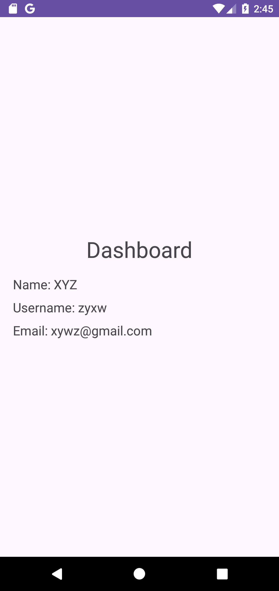

# 🔐 SignIn_SignUp_Firebase_App - Secure User Authentication for Android

Welcome to the **SignIn_SignUp_Firebase_App** repository! This Android application demonstrates a robust implementation of user authentication using Firebase Realtime Database. It features secure sign-up and sign-in processes with full front-end and back-end validation, making it an ideal project for learning and showcasing authentication techniques in Android apps.

## 📖 Table of Contents
1. [App Overview](#app_overview)
2. [Features](#features)
3. [Screenshots](#screenshots)
4. [Purpose](#purpose)
5. [How to Use](#how_to_use)
6. [Firebase_Realtime_Database_Rules](#firebase_realtime_database_rules)
7. [Contribute](#contribute)
8. [License](#license)

---

## App_Overview

### Sign-Up Page
- Users can create an account by providing a valid name, username, email, and password. The app enforces strong validation rules to ensure data integrity.

### Sign-In Page
- Existing users can sign in using their username and password. The app checks credentials against the Firebase Realtime Database and displays appropriate messages for incorrect or non-existent users.

### Dashboard
- After successful sign-in, users are redirected to a dashboard where their details such as name, username, and email are displayed, fetched directly from Firebase.

---

## Features
- **Secure Authentication**: Implements Firebase Realtime Database for storing and retrieving user data with secure validation rules.
- **Front-end and Back-end Validation**: Ensures user inputs are validated both in the app and on the server side.
- **Intuitive UI**: Simple and user-friendly interface designed with Material Design principles.
- **Real-time Data**: User information is fetched in real-time from Firebase and displayed on the dashboard.

---

## Screenshots
Here are some screenshots of the app to give you an idea of its functionality and design:

### Splash Screen Page


### Sign-Up Page


### Sign-In Page


### Dashboard


### Toast Messages


---

## Purpose
This app was developed as an educational project to demonstrate the integration of Firebase Realtime Database for user authentication in Android. It serves as a practical example of implementing secure sign-up and sign-in functionality, complete with data validation and real-time data retrieval.

---

## How_to_Use
1. **Clone the repository**:

   ```bash
   git clone https://github.com/yourusername/SignIn_SignUp_Firebase_App.git

2. **Open the project in Android Studio**.
3. **Set up Firebase**:
     - Add your Firebase project configuration to the app.
     - Ensure Firebase Realtime Database and Authentication are enabled.
4. **Build and run the app on your device or emulator**.
5. **Test the sign-up and sign-in functionality**.

---

## Firebase_Realtime_Database_Rules

The security rules for this project are crucial to ensure that only authenticated users can read and write data securely. You can find the Firebase Realtime Database rules file in this repository at the following location:

[Firebase Realtime Database Rules](rules.txt)

Make sure to review and update the rules as necessary to maintain the security of the application.

### Firebase Rules Location in the Project

- **File Path**: `https://github.com/himanshumaurya0007/SignIn_SignUp_Firebase_App/blob/main/rules.txt`
- **Purpose**: Defines the read/write permissions and data validation for the Firebase Realtime Database used in this application.
  
---

## Contribute
Contributions are welcome! If you have ideas for improving this project, feel free to fork the repository and submit a pull request.

1. **Fork the project.**
2. **Create your feature branch.**
   
   ```bash
   git checkout -b feature/AmazingFeature

3. **Commit your changes.**

   ```bash
   git commit -m 'Add some AmazingFeature'
  
4. **Push to the branch.**

   ```bash
   git push origin feature/AmazingFeature
  
5. **Open a Pull Request.**

---

## License
This project is licensed under the MIT License - see the [License](LICENSE) file for details.
